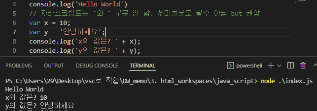

```
지금까지 배운 것은 정적 웹!
- 정적 웹
    = HTML + CSS + JavaScript

- SCSS
    = 기존 CSS의 버전 업

지금 쓰는 HTML/css은 5버전, html과 css는 업데이트가 매우 드물다
javascript는 버전 업이 매우 빠르다(1, 2년에 한번씩 됨)

- JavaScript
    = 팝업창 구현, 서버 데이터 처리

- JavaScript 버전 5 (ES 5) 배울 것임
    = 대부분의 it 회사들이 5나 6를 사용중임
    5와 6는 문법이 많이 다르다!
    둘 다 공부하는게 좋음

    **React, Angular, Vue 모두 버전 6 이상으로 구현된 자바스크립트

    페이스북에서 만든 React가 메인!!

- node.js 설치
    1. 16.14.0 안정적인 버전 설치(필수요소 체크박스 체크하고 설치)
    2. cmd창에서 node -v 입력해서 버전이 출력되는지 확인!
    3. 사용할 폴더에서 vsc를 열고 terminal - new terminal - node i 까지 쓰고 탭키 누르면 node .\index.js 입력되고, 엔터를 눌러서 실행시킬 수 있음.
```

```
자바스크립트가 원래 프론트언어였지만 업데이트를 거친 지금은 자체적으로 백엔드 작업까지 수행 가능해졌다.

자바스크립트는 데이터타입도 구분하지 않는다.

바닐라JS 공부

```