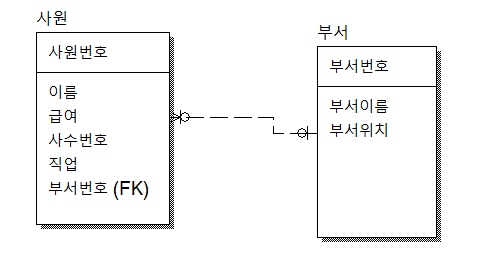

## SQL 
```sql
- EXISTS
    where절에 옴
    괄호 안이 참이면 메인쿼리가 실행이 되고, 거짓이면 실행되지 않는다.
    ** EXISTS는 단지 서브쿼리 데이터가 있는지 없는지만 판단하며, 결과값은 메인쿼리에서 나온다. (EXISTS 서브쿼리의 SELECT는 중요하지 않다.)

    select
        *
    FROM emp
    WHERE EXISTS (
        SELECT * 
        FROM emp WHERE 
        job = 'manager'
    )
    ====> 서브쿼리가 TRUE 이기 때문에 메인쿼리가 실행된다.

- NOT EXISTS
    EXISTS와 반대. FALSE(거짓)이면 메인쿼리가 실행됨

- EXISTS 의 사용
    UPDATE 할 때 사용
    
    ex) 카카오뱅크에서 입출금내역이 없는 경우 업데이트 안 함.
        입충금내역이 있는 경우 백업실행 컬럼의 백업날짜 220222로 업데이트
    update 백업실행
    set 백업날짜 = '220222'
    where exists
    (
        select *
        from 입출금내역
    )
```

## 모델링
```
테이블 : EMP
컬럼 : empno, enmae, dname, loc

새로 기획팀 데이터를 insert하는데 사원이 아직 없다.
새로운 팀이 생길 때마다 null이 늘어남.

100, 홍길동, 개발팀, 대전
null, null, 기획팀, 대전 
null, null, 사업팀, 서울

*테이블에 null 데이터가 많으면 정규화(모델링) 고려 대상

따라서 update가 필요함
*update는 delete한 후에 insert하는 과정
```

## PK와 FK 그리고 유니크 키
```
1. PRIMARY KEY (PK)
    : 중복허용 안 됨
      자동으로 인덱스가 붙음

2. FOREIGN KEY (FK)
    : 중복허용 됨
      인덱스가 없음
      index를 생성해야 함
        ```
        CREATE INDEX <인덱스명>
        ON <테이블명> (컬럼명1, 컬럼명2, ...);
        ```
    만약, 중복허용이 안 되게 만들고 싶은 경우
        : 해당컬럼에 unique key를 사용

3. UNIQUE KEY 문법
    ```
    CREATE TABLE emp(
        deptno int,
        UNIQUE KEY emp(deptno)
    )
    또는

    CREATE TABLE emp(
        deptno int UNIQUE KEY
    )
    ```

- 테이블에 데이터가 많아지면 index를 활용해서 찾는게 빠르다.
    => 테이블 앞에 index를 붙여줘야 한다.
    => 그게 바로 PK
```
```
ER 프로그램 다운로드
file-new를 누르면 create model 창이 나오고
logical : 모델링만
physical : 모델링 + create

logical로 실행
model - model properties - notation - ie 체크

entity 버튼 눌러서 테이블 생성
테이블 클릭한 상태에서 tab키 눌러서 아래로 내림
더블클릭해서 누르면 테이블 상태 나옴
데이터타입 수정 & 새 컬럼 추가
관계 버튼중에 실선 클릭, pk가 될 테이블을 누르고 fk가 만들어질 테이블을 클릭하면 연결됨
=> 논리적 모델링 완성

실선으로 된 아이콘은 유니크 키 만드는 기능
```

사진경로 수정 주의

```
모델링

길동이는 프로축구에 입단을 하게 되었다. 축구팀은 총 20개고 그 중 팀 하나를 선택해서 갈 수 있다.
선수 테이블과 팀 테이블을 만들어 활용해 보자.

==> 팀 번호가 선수 테이블에 FK로 존재해야 한다.(하나의 팀만 가짐)
==> 1 : n 관계 

만약 FK에 유니크 키를 주면 1 : 1 관계가 된다.

다대다(Many-to-Many) 테이블
    : 단독으로 존재가 불가능한 테이블
    다른 것들로 인해서 존재가 가능한 테이블이다.

    구매이력 테이블을 만드려면 회원(누가 구매했는지), 상품(어떤걸 구매했는지) 테이블이 있어야 한다.
    구매이력 테이블이 다대다 테이블이다.

    학생 테이블과 반 테이블이 존재해야 등록 테이블이 있을 수 있다.
    등록 테이블은 다대다 테이블이다. 

    ex)
    교사, 학생, 수업
    선수, 팀, 리그(대회)
```
  
사진경로 수정 주의

```
주제 : 영화관
영화관 테이블에는 현재 상영 중인 영화를 관리
회원 테이블에는 회원 정보와 포인트를 관리
회원이 영화를 볼 때마다 영화관람 테이블에 날짜와 영화이름을 기록해야 한다.

고객 요청 **** 포인트가 500점이 넘으면 GOLD 회원, 1000점이 넘으면 PLATINUM 회원, 1500점이 넘으면 DIAMOND 회원

==> 영화관람 테이블이 다대다 테이블
==> 등급 테이블을 참조하는 회원테이블은 1:n 테이블
```

등급 업데이트 방법 2가지
    1. 자바에서, 포인트가 올라가면 등급번호 업데이트
    2. sql 트리거로, 포인트가 일정치 올라가면 자동으로 DB내에서 올라가게 할 수 있음


```sql
SELECT
    avg(평점)
FROM 영화관람
GROUP BY 영화번호
```
==> 평점은 관람할 때마다 쌓이는 데이터이므로 영화 테이블이 아니라 영화관람 테이블에 있어야 한다.
나중에 영화번호로 그룹을 묶고 평점들을 모두 더해 평균을 낼 수 있다.

