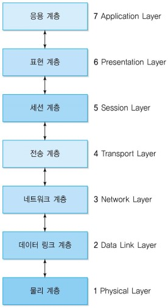

```
데이터 단위
    ** 비트(b) -> 바이트(B) -> KB -> MB -> GB -> TB -> PB -> @@@
    비트(bit)
        ** 데이터의 최소표현단위
        1 비트는 0과 1 "두개"만 표현  
            => 오류를 최소화하기 위해서 두개만 표현하게 만들었다.
        2 비트는 4개
        3 비트는 8개
        4 비트는 16개
        ...
        8 비트는 256개

    바이트(Byte)
        영어, 로마자, 숫자 표현하기 위해서 바이트가 나오게 됨
        ** 8 비트 = 1 바이트
        8비트가 1바이트인 이유
            영어 약 50개 + 숫자 0~9 10개 + 특수문자 66개 + 기타(국가코드) = 총 256가지
        char : 1바이트. 문자 한개만 쓸 수 있음
            char x = "a";
            영어는 1바이트, 한글은 2바이트

    단위 변환
        2^10(1024) B = 1 KB
        2^20 B = 1 MB
        2^30 B = 1 GB
        2^40 B = 1 TB
        2^50 B = 1 PB

        2^10씩 곱하면서 KB, MB, GB, TB, PB가 됨

하드디스크 VS 메모리
    하드디스크 : 저장 공간(데이터가 영구적으로 남아 있음)
        1TB, 100TB
    메모리 : 저장 공간(데이터가 날라감)
        8GB, 16GB, 32GB
    차이
        1. 데이터가 영구적으로 남아 있는지 유무
        2. 저장하는 데이터가 다름
            하드 디스크 : 사진, 영상 등 소스파일들
            메모리 : 이클립스와 메모장을 실행하면 이클립스와 메모장이 저장되어 있음
                메모리가 클수록 동시에 여러개를 실행할 수 있음

서버
    서비스를 제공해주는 주체(어떤 것이든 서버가 될 수 있음)
    고객이 서비스(데이터베이스, 웹, 앱)에 접속하려면 서버의 주소를 알아야 함
        주소(IP)는 도로명 주소처럼 변동될 수 있다.
    일반 컴퓨터는 IP를 1개만 가짐

    서비스를 이용하기 위해서 주소(IP)뿐만 아니라 식별번호(PORT 번호)를 알아야 한다.
    하나의 주소에 웹과 앱이 모두 있고, 웹과 앱 각각의 식별번호로 사용자들이 접근할 수 있다.

    주소(IP) : 192.168.0.252, 식별번호(PORT) : 3306 (MySQL)
        => 192.168.0.252:3306
        192.168.0.252:3306 (mysql DB)
        192.168.0.252:8080 (spring)

    netstat -a로 IP 주소 확인
        192.168.0.252 : 선생님 IP
            (같은 망을 사용하는)다른 사람에게 알려줄 때 이 주소를 알려주면 됨
        127.0.0.1 : 표현방법이 다른 선생님IP. but 이건 변하지 않는 번호. 모든 컴퓨터가 같은 번호
            내가 내 서비스 접속할 땐 이 주소로 접속해도 됨
            = 로컬호스트

와이파이(공유기 or router)
    사용자에게 IP 부여
    공유기로 들어오는 IP가 진짜 아이피, 와이파이에서 주는 IP는 내부 아이피(가짜 아이피)
        이유 ) 아이피가 부족하기 때문. 여러명이 사용할 수 있게 가짜 아이피 부여
    다른 사람이 접속하게 하려면 가짜 아이피가 아닌 진짜 아이피를 알려줘야 한다.

    선생님 IP 중 252는 비트로 표현된 것으로 0~255까지 존재한다.

    진짜 아이피는 구글에서 찾거나, 공유기에 접속하면 알 수 있다.

    우리가 네이버에 접속할 때, 컴퓨터는 공유기의 진짜 IP 주소로 네이버 데이터센터에 접근한다.

IP
    인터넷을 사용할 수 있는 논리적인 주소
    고유한 값(중복 X) => 전세계 사람들이 사용하기에 IP가 부족함 => 공유기(라우터) 사용
    공유기 사용 이유
        1. 보안
        2. IP 부족
    공유기로부터 받은 IP는 가짜(내부IP 또는 Private IP), 공유기로 들어오는 IP가 진짜(외부IP 또는 Public IP)
    내부 IP로는 같은 공유기로부터 IP를 부여받은(같은 내부를 가지는) 컴퓨터만 접속이 가능하다

    다른 공유기에 접속하는 방법
        내가 쓰는 공유기로부터 외부아이피(Public IP)를 받아서 다른 공유기의 외부아이피(Public IP)로 접속
    
    IP와 포트번호
        IP뿐만아니라 식별번호(포트번호)까지 알려줘야 어떤 서비스에 연결할지 판단하고 접속할 수 있다.

    Public IP를 새로 사용하기 위해서는 ISP업체(KT, SKT, LG 등)에 문의해야 한다.

    Private IP 특징
        브로드캐스팅 : 특정 IP와 연결하기 위해서 우선 같은 내부망에 있는 모든 IP와 연결하는 것
        터널링 SSH : 은행같은 곳에서 쓰는 Private 안의 Private 같은 느낌

    Private 공간 = 서브넷
        하나의 공유기 아래의 Private IP를 쓰는 Private한 공간을 서브넷이라고 한다.
        만약 두 컴퓨터의 서브넷이 같다면 Private IP로 접근할 수 있다.

    0.0.0.0 ~ 255.255.255.255
    IP는 .(옥텟)으로 나뉘어지는 1개당 1바이트, 총 4바이트의 크기를 가짐
    총 2^8 * 2^8 * 2^8 * 2^8 = 2^32개의 IP가 있다.
HTTP
TCP
    나오게 된 배경
        1. 회선교환방식
            통신의 경로가 정해져 있음
            단점 : 통신을 중계해 주던 곳이 박살나거나 중간에 선 하나가 단락되는 것만으로 통신이 끊김
        2. 패킷교환방식
            통신의 경로가 정해져 있지 않음
            서로 연결이 가능한 회선 하나만 남아있어도 통신이 끊어지지 않고 계속될 수 있음
            단점 : 어떻게든 통신을 유지하는 것이 목적이기 때문에 네트워크 환경의 안정성이 떨어졌고, 중간에 데이터가 유실되거나 늦게 전달되는 등 신뢰성이 떨어졌음.
    통신 절차
        1. 상대에게 통신을 하고 싶다는 메시지를 보냄
        2. 상대는 메시지에 대한 응답(준비되었다는 메시지)을 보냄
        3. 2번에서 받은 메시지에 응답을 보냄
        이 과정으로 나와 상대가 통신준비를 마쳤고, 연결되어 있음을 보장하게 된다.

Public IP 또는 Private IP는 고정적/유동적일 수 있음
    고정 IP(Static IP)
        하나의 IP가 한 사람에게 고정배정됨(다른 사람은 쓸 수 없음)
        ex) 회사, 메인 서비스 서버(컴퓨터)
    유동 IP(DHCP, Dynamic Host Configuration Protocol)
        하나의 IP가 여러 사람에게 번갈아가며 배정될 수 있음
        ex) 카페, 병원, 식당, 집
```
```
OSI 7 계층 단계
    네트워크에 연결된 호스트는 7개 계층으로 모듈화된 통신 기능을 갖추어야 한다. 
    일반 사용자는 OSI 7계층 맨 위에 있는 응용 계층을 통해 데이터의 송수신을 요청하며, 이 요청은 하위 계층으로 순차적으로 전달되어 맨 아래에 있는 물리 계층을 통해 상대 호스트에 전송된다. 그리고 요청이 각 계층으로 하달되는 과정에서 계층별로 담당하는 기능을 수행해 데이터를 안전하게 전달한다.
    [네이버 지식백과] 계층 모델 (데이터 통신과 컴퓨터 네트워크, 2013. 9. 10., 박기현)
```
