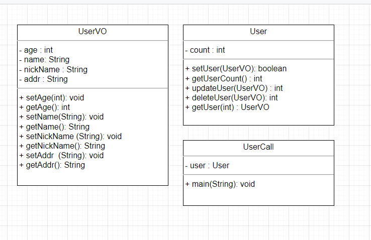

## 1교시
- 클래스는 필드변수(전역변수)와 메소드로 구성       

- 필드변수 앞에는 접근지정자가 옴       
    public, private, protected, default public      

- 자바에서 클래스는 객체(object)다!     

- 객체는 고유한 특성과 행동을 가짐      
    ex) 학교
        특성) 1. 학생 수        
              2. 교직원 수      
              3. 반 수      
        행동) 1. 수업을 듣다.       
              2. 선생님한테혼나다.      
              3. 교장선생님연설을듣다.      

- 객체를 하는 이유?     
    1. 업무 분담을 위해서 (주 이유)     
    2. 일의 효율성을 위해서            

- 학교 s = new 학교();      
new를 사용해야 학교 클래스 안에 있는 필드변수와 메소드 사용 가능.       

- this 사용      
```java
class Pizza{
    public String 피자종류; // 필드변수
    public void 피자를먹다(){ // 메소드
        this.피자종류 = "치즈피자";
    }
}
```

- 생성자        
```java
public class Pizza {
	String 피자종류; // 필드변수
	public int getSum(int x, int y) {
		return 0;
	}
	public Pizza(String 피자종류) { // 클래스를 생성하면 디폴트로 생성자가 존재(특수 메소드)
		// 1. 리턴타입이 없음. 함수 이름은 클래스이름과 동일.
		// 2. 필드변수의 값을 대입할 때 사용. 
		this.피자종류 = "치즈피자"; // 필드변수에 값을 대입할 때 사용
		// 파라미터에 있는 변수와 필드변수의 이름이 중복가능하기 때문에 this로 구분
		// 3. 파라미터에 데이터를 받을 수 있음.(괄호안의 "String 피자종류")
		String 피자종류 = ""; // 오류남. 지역변수는 파라미터 변수이름과 동일할 수 없음.
	}


	public static void main(String[] args) {
		String pizza = "치즈피자";
		Pizza p = new Pizza(pizza); // 생성자에 파라미터값이 있으면 메소드와 동일하게 파라미터값을 넣어야 함.
		String result = p.피자종류;
		System.out.println(result); // 치즈피자 출력됨!
	}
}
```

## 2교시
- 생성자 사용       
- 생성자 사용 문제      
1. 학원이라는 클래스 생성
2. 필드변수 종류
    1. int 학생수
    2. String 교사이름
3. 생성자 2개 생성(생성자 생성 후 필드변수 초기화)
    1. 디폴트 생성자
    2. int와 String을 받는 생성자. 

```java
public class 학원 {
	int 학생수; // int형 필드변수는 디폴트로 0
	String 교사이름; // 디폴트로 null
	public 학원(){ // 생성자 1 디폴트 생성자를 사용하고 싶으면 적어줘야 한다!
	}
	public 학원(int 학생수, String 교사이름) { // 생성자 2
		this.학생수 = 학생수; // 필드변수 초기화!
		this.교사이름 = 교사이름;
	}
}


public class 생성자연습1 {
	public static void main(String[] args) {
		학원 h1 = new 학원();
		int 학생수 = 16;
		String 교사이름 = "철수";
		System.out.println(h1.학생수); // 디폴트 값
		System.out.println(h1.교사이름); // 디폴트 값
		
		학원 h2 = new 학원(학생수, 교사이름);
		System.out.println(h2.학생수); // 대입한 값
		System.out.println(h2.교사이름); // 대입한 값
	}
}


출력된 값
0
null
16
철수
```

## 3교시
- 생성자 사용 문제2      
1. 영화관 클래스 생성 (메인메소드 x)
  클래스 이름은 Movie
2. Movie 클래스에는 3개의 필드변수 존재
 2-1. String name; //영화관 이름
 2-2. String location; //영화관 위치
 2-3. int count; //직원 수 
3. Movie 클래스에는 3개의 생성자 존재 (초기화 해줄 것)
 3-1. 디폴트 생성자
 3-2. 파라미터에 영화관 위치가 있는 생성자
 3-3. 파라미터에 모든 필드변수가 오는 생성자
4. 일반 메소드 1개 존재
 4-1. 접근지정자가 public 리턴타입이 int 메소드 이름은 getMovie
      파라미터는 없음.

```java
public class Movie {
	String name; // 영화관 이름
	String location; // 영화관 위치
	int count; // 직원 수
	public Movie() { // 디폴트 생성자
		// 디폴트생성자를 무시하고 파라미터가 있는 생성자를 만들면 디폴트생성자는 없어짐
		// 사용하고 싶으면 이렇게 따로 만들어야 한다
	}
	public Movie(String location) { // 위치 생성자
		this.location = location; // 필드변수 초기화
	}
	public Movie(String name, String location, int count) { // 모든변수 생성자
		this.name = name;
		this.location = location;
		this.count = count;
	}
	public int getMovie() { // 일반 메소드
		return 0;
	}
}
```

```java
public class 생성자연습1 {
	public static void main(String[] args) {
		String name = "DW";
		String location = "중앙로역"; 
		int count = 10;
		Movie Md = new Movie(); // new = 클래스 호출(객체화), 클래스이름 () = 클래스 생성자 호출
		Md.count = 5; // 이 방법을 많이 사용
		Movie Mloc = new Movie(location);
		Movie Mall = new Movie(name, location, count);
		System.out.println("영화관 이름은 "+Md.name); // null(디폴트)
		System.out.println("위치는 "+Md.location); // null(디폴트)
		System.out.println("직원수는 "+Md.count); // 5(디폴트는 0이지만 5를 대입해줬음)
		System.out.println("영화관 이름은 "+Mloc.name); // null(디폴트)
		System.out.println("위치는 "+Mloc.location); // 중앙로역
		System.out.println("직원수는 "+Mloc.count); // 0(디폴트)
		System.out.println("영화관 이름은 "+Mall.name); // DW
		System.out.println("위치는 "+Mall.location); // 중앙로역
		System.out.println("직원수는 "+Mall.count); // 10
	}
}
```

## 4교시
```java
public class 일식당 {
	// 실무에서 쓰는 생성자 대신 데이터 초기화 방법 (책에 없음!!!!)
	// 1. 필드변수 접근지정자에 private으로 선언
	// 2. 각 변수들마다 함수를 만들어 줌
	private String porkCutlet; // 돈까스
	// set 함수
	public void setPorkCutlet (String porkCutlet) { //메소드 생성
		// void를 이용해서 필드변수를 초기화
		this.porkCutlet = porkCutlet;
	}
	//get 함수
	public String getPorkCutlet() {	
		return this.porkCutlet;
	}
}


public class 생성자연습1 {
	public static void main(String[] args) {
		일식당 a = new 일식당();
		a.setPorkCutlet("안심돈까스"); // set으로 안심돈까스를 세팅함
		String 돈까스 = a.getPorkCutlet(); // set한 데이터를 get함
		System.out.println(돈까스);
		// 실무에선 이렇게 set과 get을 이용한다.
	}
}
```

```java
public class 연습2 {
	private String porkCutlet;
	private String price;
	public String getPorkCutlet() {
		return porkCutlet;
	}
	public void setPorkCutlet(String porkCutlet) {
		this.porkCutlet = porkCutlet;
	}
	public String getPrice() {
		return price;
	}
	public void setPrice(String price) {
		this.price = price;
	}
	// 보일러 템플릿 코드 : set과 get 노가다 작업을 쉽게 해 줌
	// 단축키 : Alt + Shift + s
	// select all 클릭 - generate - 메소드 생성됨!
}


public class 연습2돈까스와가격 {
	public static void main(String[] args) {
		연습2 a = new 연습2();
		a.setPorkCutlet("황금치즈돈까스");
		a.setPrice("5만원");
		String 돈까스 = a.getPorkCutlet();
		String 가격 = a.getPrice();
		System.out.println(돈까스);
		System.out.println(가격);
	}
}
```

```java
public class 일식당VO { 
	// 1. 실무에서 생성자로 필드변수 초기화 잘 안 함!
	// 2. set, get 함수 이용해서 필드변수 초기화
	// 3. set, get 함수가 있는 클래스에는 절대로 다른 함수를 정의하지 않는다!!!
	//	ex) getSum, getResult 같은것 쓰지 않는다
	// 4. set, get이 있는 클래스이름 뒤에 VO(Value Object)를 붙이자!
	//	VO대신 DTO(Data Transfer Object)라고 쓰기도 함
}
```

```java
public class KoreaVO { // 이름 뒤에 VO 붙이기!
	private String location; // 지역 이름
	private String addr; // 주소
	private String name; // 지역 대표자
	private int count; // 지역 수
	// Alt + Shift + s 로 생성
	public String getLocation() {
		return location;
	}
	public void setLocation(String location) {
		this.location = location;
	}
	public String getAddr() {
		return addr;
	}
	public void setAddr(String addr) {
		this.addr = addr;
	}
	public String getName() {
		return name;
	}
	public void setName(String name) {
		this.name = name;
	}
	public int getCount() {
		return count;
	}
	public void setCount(int count) {
		this.count = count;
	}
}


public class 연습2 {
	public static void main(String[] args) {
		KoreaVO k = new KoreaVO();
		k.setLocation("대전");
		String 지역 = k.getLocation();
		k.setAddr("중앙로역");
		String 주소 = k.getAddr();
		k.setName("유영준");
		String 대표자 = k.getName();
		k.setCount(10);
		int 지역수 = k.getCount();
		
		System.out.println(지역);
		System.out.println(주소);
		System.out.println(대표자);
		System.out.println(지역수);
	}
}
```

예를 들어 네이버 회원가입할 때 id, 비밀번호, 이름, 주소, 성별, 이메일 등등을 사용자가 입력하면 set된 데이터들을 서버에서 get 한다.

## 5교시
- UML(Unified Modeling Language)        
통합 모델링 언어        
즉 모델을 만드는 표준 언어      

소프트웨어 초기 스케치 작업     

사용하는 이유       
    1. 다른 사람들과 의사소통 또는 설계 논의       
    2. 전체 시스템 파악     
    3. 유지보수를 위한 설계의 bach-end 문서

-는 private +는 public

## 6교시
```java

public class UserVO {
	private int age;
	private String name;
	private String nickName;
	private String addr;

	public int getAge() {
		return age;
	}
	public void setAge(int age) {
		this.age = age;
	}
	public String getName() {
		return name;
	}
	public void setName(String name) {
		this.name = name;
	}
	public String getNickName() {
		return nickName;
	}
	public void setNickName(String nickName) {
		this.nickName = nickName;
	}
	public String getAddr() {
		return addr;
	}
	public void setAddr(String addr) {
		this.addr = addr;
	}
}


public class User {
	private int count;
	
	public boolean setUser(UserVO vo) { // 파라미터로 클래스를 받음
		return true; // boolean은 return을 true or false로 갖는다!
	}
	public int getUserCount() {
		return 0;
	}
	public int updateUser(UserVO vo) {
		return 0;
	}
	public int deleteUser(UserVO vo) {
		return 0;
	}
	public UserVO getUser(int id) {
		return null;
	}


public class UserCall {
	private User user;
	public static void main(String[] args) {
		User user = new User();
		UserVO vo = new UserVO();
		vo.setAddr("대전 충정로");
		vo.setAge(50);
		vo.setName("홍길동");
		vo.setNickName("몽키.D.길동");
		user.setUser(vo);
	}
}
```

## 7교시
복습

