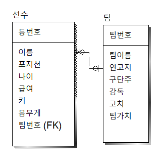
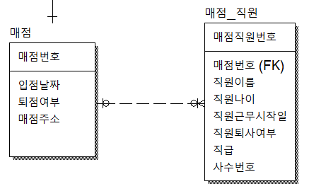
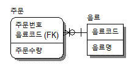
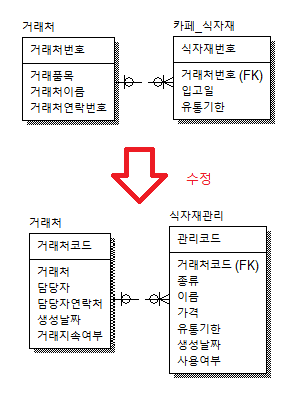
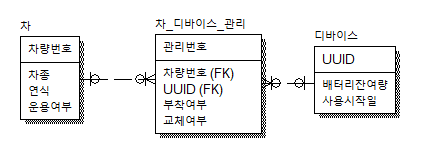
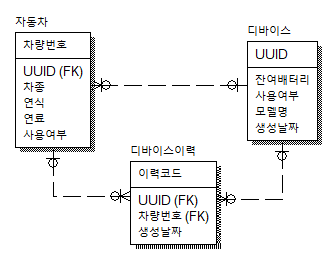
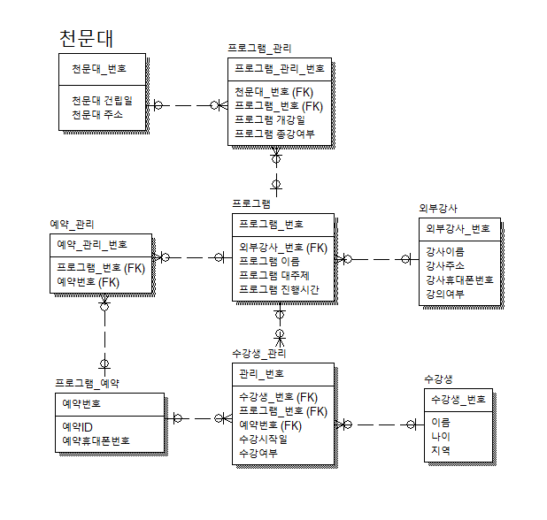

- ## 모델링(정규화)
    ```
    테이블 : EMP
    컬럼 : empno, enmae, dname, loc

    새로 기획팀 데이터를 insert하는데 사원이 아직 없다.
    새로운 팀이 생길 때마다 null이 늘어남.

    100, 홍길동, 개발팀, 대전
    null, null, 기획팀, 대전 
    null, null, 사업팀, 서울

    *테이블에 null 데이터가 많으면 정규화(모델링) 고려 대상

    따라서 update가 필요함
    *update는 delete한 후에 insert하는 과정
    ```
- ## 역정규화
    ```
    테이블을 나눴는데 나눈 테이블에 데이터가 잘 안 쌓이는 경우(테이블에 데이터가 적은 경우).
    논리적으로는 나뉘는게 맞지만 데이터가 적은 테이블로 나뉘는 것도 손실이라고 생각함.
    => 역정규화 필요
    ```
- ### 분산저장
    ```
    구글에 MySQL replication 검색
    ```
- ## 순서
    ```
    0. 테이블 설계
    1. 정규화
    2. 역정규화 (optional)
    3. 분산저장 (optional)
        한 컴퓨터에서 데이터를 모두 감당하기 힘들정도로 많을 때, 여러 컴퓨터에 나눠서 분산 저장함
        데이터가 나눠진 컴퓨터는 주기적으로 동기화시켜준다.
        각 컴퓨터에 권한을 나눔(한 컴퓨터는 select만 가능, 다른 컴퓨터는 insert/update/delete만 가능)
        => 이런 과정을 replication(복제) 라고 함.
    ```
- ### PK와 FK 그리고 유니크 키
    ```
    1. PRIMARY KEY (PK)
        : 중복허용 안 됨
        자동으로 인덱스가 붙음

    2. FOREIGN KEY (FK)
        : 중복허용 됨
        인덱스가 없음
        index를 생성해야 함
            ```
            CREATE INDEX <인덱스명>
            ON <테이블명> (컬럼명1, 컬럼명2, ...);
            ```
        만약, 중복허용이 안 되게 만들고 싶은 경우
            : 해당컬럼에 unique key를 사용

    3. UNIQUE KEY 문법
        ```
        CREATE TABLE emp(
            deptno int,
            UNIQUE KEY emp(deptno)
        )
        또는

        CREATE TABLE emp(
            deptno int UNIQUE KEY
        )
        ```

    - 테이블에 데이터가 많아지면 index를 활용해서 찾는게 빠르다.
        => 테이블 앞에 index를 붙여줘야 한다.
        => 그게 바로 PK
    ```

- ### 관계종류
    1. 원투매니 (1:n)
        1-1. 한 부서에 여러명이 속함(반 하나에 학생 N명)
        1-2. 한 팀에 여러 선수가 있음

    2. 원투원 (1:1)
        2-1. 군인과 총기
        2-2. 팀과 감독

    3. 매니투매니 (Many-to-Many / n:n) 또는 다대다 테이블
        단독으로 존재가 불가능한 테이블
        다른 것들로 인해서 존재가 가능한 테이블이다.

        구매이력 테이블을 만드려면 회원(누가 구매했는지), 상품(어떤걸 구매했는지) 테이블이 있어야 한다. 따라서 구매이력 테이블은 다대다 테이블이다.

        학생 테이블과 반 테이블이 존재해야 등록 테이블이 있을 수 있다.
        등록 테이블은 다대다 테이블이다. 

        요리사와 재료가 있어야 요리가 만들어짐(요리 테이블은 부모를 두개 갖는데 이걸 정해진 부모가 없다고 말하기도 한다.)

        ex)
        교사, 학생, 수업
        선수, 팀, 리그(대회)
        요리사, 재료, 요리
    

- ### 모델링 연습
    ```
    1) 길동이는 프로축구에 입단을 하게 되었다. 축구팀은 총 20개고 그 중 팀 하나를 선택해서 갈 수 있다. 선수 테이블과 팀 테이블을 만들어 활용해 보자.

    ==> 팀 번호가 선수 테이블에 FK로 존재해야 한다.(하나의 팀만 가짐)
    ==> 1 : n 관계 

    만약 FK에 유니크 키를 주면 1 : 1 관계가 된다.
    ```
      


    ```
    2) 영화관 테이블에는 현재 상영 중인 영화를 관리
    회원 테이블에는 회원 정보와 포인트를 관리
    회원이 영화를 볼 때마다 영화관람 테이블에 날짜와 영화이름을 기록해야 한다.

    고객 요청 **** 포인트가 500점이 넘으면 GOLD 회원, 1000점이 넘으면 PLATINUM 회원, 1500점이 넘으면 DIAMOND 회원

    ==> 영화관람 테이블이 다대다 테이블
    ==> 등급 테이블을 참조하는 회원테이블은 1:n 테이블

    등급 업데이트 방법 2가지
        1. 자바에서, 포인트가 올라가면 등급번호 업데이트
        2. sql 트리거로, 포인트가 일정치 올라가면 자동으로 DB내에서 올라가게 할 수 있음

    ==> 평점은 관람할 때마다 쌓이는 데이터이므로 영화 테이블이 아니라 영화관람 테이블에 있어야 한다. 나중에 영화번호로 그룹을 묶고 평점들을 모두 더해 평균을 낼 수 있다.

    SELECT
        avg(평점)
    FROM 영화관람
    GROUP BY 영화번호
    ```
    

    ```
    3) 영화, 영화관람, 회원, 등급 테이블에 영화관 테이블 추가

    요구사항 
        1)
        회원은 여러 영화관에 회원가입할 수 없다. (한 명의 회원은 하나의 영화관에만 가입한다.)

        1. 영화관 테이블에 회원번호가 있을 경우, 영화관에 다른 회원은 가입 불가능!!
        2. 회원 테이블에 영화관번호가 PK면 다른 회원은 해당 영화관에 가입할 수 없다.
        3. 회원 테이블에 영화관 번호가 FK로 되어 있어야 한다!!

        2)
        회원은 여러 영화관에 회원가입할 수 있다.
        => 다대다 관계
        => 다대다는 테이블을 추가해야 한다.

        3)
        영화관에 매점을 오픈하려고 한다. 하지만, 매점은 오직 하나의 영화관에만 소속될 수 있다.
        영화관도 매점 한개만 오픈할 수 있다.

        관계를 먼저 보자!
        영화관은 매점 한 개만!, 매점도 영화관 한 곳만! => 원투원
        ==> 영화관 테이블 PK자리에 매점번호(FK)를 올려준다.
    ```
    

    주의 : 영화관 테이블과 매점 테이블의 관계에서만 매점번호에 FK를 주고 싶은데 프로그램에서 영화관테이블에 있는 매점번호(FK)를 올려줬더니, 영화관 테이블에 연결돼 있는 다른 테이블에도 영향이 갔음.(원래 다른 테이블은 표기되지 않고 매점번호 테이블과의 관계만 설정해 줘야 하는데 프로그램상 오류임!)
    ```
    요구사항
        4)
        매점 오픈됨!
        직원을 채용해야 한다.
        매점은 여러 직원을 채용할 수 있고, 직원은 이중취업이 불가능. 
    ```
    
    ```
    요구사항
        5)
        직원은 여러 매점에서 일할 수 있다.
        ex) 오전파트는 A매점, 오후파트는 B매점
        매점은 여러 직원을 채용할 수 있다.
        
    컬럼명이 지점명
    큰 매점 아래 a지점, b지점
    ```
    
    4) 정규화 필요 테이블  
      
    ```

        주문번호, 음료코드, 주문수량, 음료명
    1. 202005051001, 1001, 325, 아메리카노
    2. 202005051002, 1002, 214, 카페라떼
    3. 202005051003, 1005, 107, 바닐라라떼

    이런 테이블이 있을 경우에 문제점
    => 주문이 발생하지 않으면 음료 입력 불가(입력이상)
    => 음료명이 변경되면 해당 주문 전체 update 필요(수정이상)
    => 음료명 삭제시 주문까지 삭제됨(삭제이상)

    따라서 정규화가 필요하다!!
    ```
    

        => 주문과 관계없이 음료 데이터 입혁, 수정, 삭제 가능!!

    ```
    - 테이블을 만들 때 컬럼에 날짜와 삭제여부 컬럼은 꼭 온다!
    - ERwin에서 매니투매니 버튼으로 연결하면 FK 표시가 안 되기 때문에 점선으로 연결해 준다.
    - 기본키가 아닌 모든 속성간에는 서로 종속될 수 없다!
    ```

    5)  
    
    ```
    수량 컬럼은 테이블에 사용하지 않는다  
    => 컬럼 갯수로 조회 가능!  

    거래품목은 거래처보단 식자재 테이블에서 관리  

    테이블에 그룹핑할 컬럼이 있어야 함(예외 존재)
    ```
    
    6) 차량 위치 추적 모델링 연습
    ```
    요구사항)
        - 차에 위치 추적 장치(이하 디바이스라 칭함)를 부착해야 한다.
        - 디바이스는 차량당 1대만 부착할 수 있다.
        - 디바이스 배터리가 0%가 되면 다른 디바이스로 교체가 된다. 
        - 어떤 차에 어떤 디바이스가 교체 되고 부착되었는지 한눈에 보고 싶다.

        디바이스같은 것들의 식별번호를 UUID라고 명함
    
    생각정리)
        1. 디바이스는 차량당 1대만 부착
        2. 디바이스는 배터리가 떨어지면 교체돼야 함
        3. 어떤 차에 어떤 디바이스가 부착되고 교체되었는지 그 이력을 조회

        차에 디바이스는 부착되거나 교체하기 위해 제거된 상태 두가지만 존재한다.

        차와 디바이스 각각은 이력이 여러번 남을 수 있다.

        어떤 디바이스가 교체되고 부착됐는지 그걸 확인하는 테이블을 만드는 방법을 모르겠다!!
    ```
    
    ```
    - 해결방법  
    디바이스 이력 테이블을 만들면 됨
    ```
    

## 천문대 프로그램 관리 시스템 모델링 연습하기

