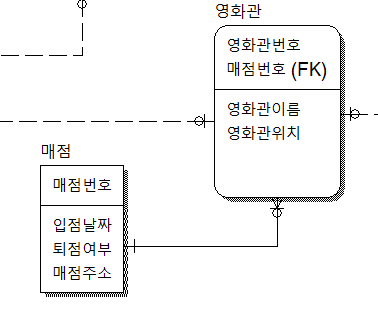
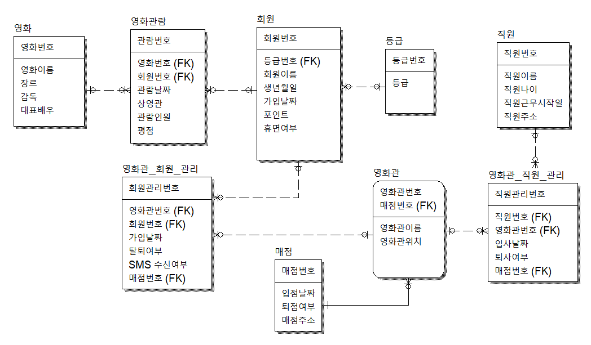
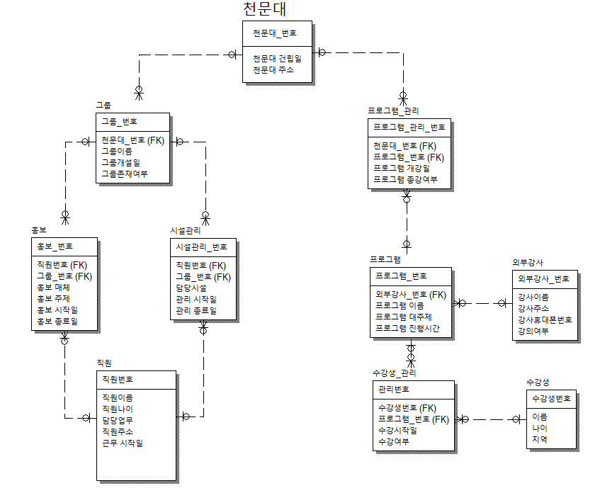

## 관계 종류
    1. 1:n (원투매니)
        1-1. 한 부서에 여러명이 속함(반=1, 학생=N)
        1-2. 한 팀에 여러 선수가 있음
    2. 1:1 (원투원)
        2-1. 군인과 총기
        2-2. 팀과 감독
    3. n:n (매니투매니)
        3-1. 요리사와 재료가 있어야 "요리"가 만들어짐(요리 테이블은 요리사와 재료라는 부모테이블을 가짐 => 정해진 부모가 없다고 말하기도 함)

## 역정규화
    테이블을 나눴는데 나눈 테이블에 데이터가 잘 안 쌓이는 경우(테이블에 데이터가 적은 경우).
    논리적으로는 나뉘는게 맞지만 데이터가 적은 테이블로 나뉘는 것도 손실이라고 생각함.
    => 역정규화 필요

## 분산저장
    구글에 MySQL replication 검색

## 순서
    0. 테이블 설계
    1. 정규화
    2. 역정규화 (optional)
    3. 분산저장 (optional)
        한 컴퓨터에서 데이터를 모두 감당하기 힘들정도로 많을 때, 여러 컴퓨터에 나눠서 분산 저장함
        데이터가 나눠진 컴퓨터는 주기적으로 동기화시켜준다.
        각 컴퓨터에 권한을 나눔(한 컴퓨터는 select만 가능, 다른 컴퓨터는 insert/update/delete만 가능)
        => 이런 과정을 replication(복제) 라고 함.

## 영화관 
    영화, 영화관람, 회원, 등급 테이블에
    영화관 테이블 추가

    요구사항)
        회원은 여러 영화관에 회원가입할 수 없다. (한 명의 회원은 하나의 영화관에만 가입한다.)

        1. 영화관 테이블에 회원번호가 있을 경우, 영화관에 다른 회원은 가입 불가능!!
        2. 회원 테이블에 영화관번호가 PK면 다른 회원은 해당 영화관에 가입할 수 없다.
        3. 회원 테이블에 영화관 번호가 FK로 되어 있어야 한다!!

    요구사항)
        회원은 여러 영화관에 회원가입할 수 있다.
        => 다대다 관계
        => 다대다는 테이블을 추가해야 한다.
    
    - 테이블을 만들 때 컬럼에 날짜와 삭제여부 컬럼은 꼭 온다!
    - ERwin에서 매니투매니 버튼으로 연결하면 FK 표시가 안 되기 때문에 점선으로 연결해 준다.

    요구사항)
        영화관에 매점을 오픈하려고 한다. 하지만, 매점은 오직 하나의 영화관에만 소속될 수 있다.
        영화관도 매점 한개만 오픈할 수 있다.

        관계를 먼저 보자!
        영화관은 매점 한 개만!, 매점도 영화관 한 곳만! => 원투원
        ==> 영화관 테이블 PK자리에 매점번호(FK)를 올려준다.

주의 : 영화관 테이블과 매점 테이블의 관계에서만 매점번호에 FK를 주고 싶은데 프로그램에서 영화관테이블에 있는 매점번호(FK)를 올려줬더니, 영화관 테이블에 연결돼 있는 다른 테이블에도 영향이 갔음.(원래 다른 테이블은 표기되지 않고 매점번호 테이블과의 관계만 설정해 줘야 하는데 프로그램상 오류임!)

    요구사항)
        매점 오픈됨!
        직원을 채용해야 한다.
        매점은 여러 직원을 채용할 수 있고, 직원은 이중취업이 불가능.    

    요구사항)
        직원은 여러 매점에서 일할 수 있다.
        ex) 오전파트는 A매점, 오후파트는 B매점
        매점은 여러 직원을 채용할 수 있다.

컬럼명이 지점명
큰 매점 아래 a지점, b지점

## ERwin 모델링 저장방법

ERwin 프로그램 상단의 tools - report template builder - 경고창 확인 - new - p버튼 - pdf 클릭하고 닫기 - export as pdf 로 나오는 것 확인 - 다시 p 눌러서 export에서 경로 수정(바탕화면) - picture 더블클릭 - picture section 클릭하고 좌측상단에 아래화살표 버튼 누르면 화면 뜸 - 캡처해서 사용

## 정규화 연습
  
    
    주문번호, 음료코드, 주문수량, 음료명
    1. 202005051001, 1001, 325, 아메리카노
    2. 202005051002, 1002, 214, 카페라떼
    3. 202005051003, 1005, 107, 바닐라라떼

    이런 테이블이 있을 경우에 문제점
    => 주문이 발생하지 않으면 음료 입력 불가(입력이상)
    => 음료명이 변경되면 해당 주문 전체 update 필요(수정이상)
    => 음료명 삭제시 주문까지 삭제됨(삭제이상)

    따라서 정규화가 필요하다!!
    

    => 주문과 관계없이 음료 데이터 입혁, 수정, 삭제 가능!!

- 기본키가 아닌 모든 속성간에는 서로 종속될 수 없다!

